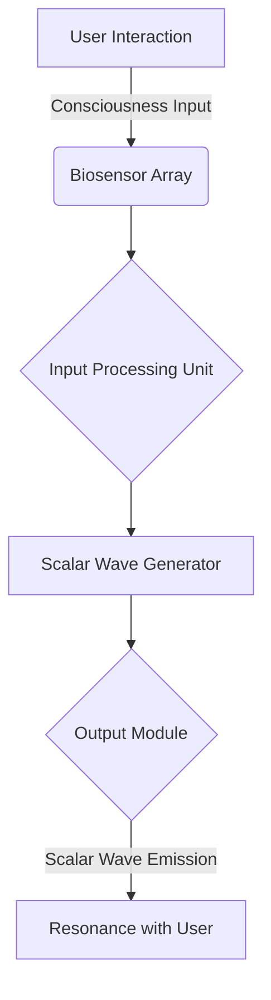

# Metaflesh & Etheric Bridge Integration System Flow for Consciousness-Integrated Scalar Wave Device

This document outlines the system flow for integrating the scalar wave device with Metaflesh and the Etheric Bridge. The architecture incorporates biosensors, consciousness input fields, and scalar wave harmonization modules.

## System Overview

The device operates by:

- Receiving inputs from biosensors and consciousness fields.
- Processing data through the central processing unit (CPU) and scalar wave generators.
- Outputting harmonized scalar waves to align with the user’s resonance field.

## Flowchart



## Detailed Components

### 1. User Interaction Layer

**Consciousness Input Fields**:
- **EEG Sensors**: Measure brainwave patterns.
- **EDA Sensors**: Track emotional and energetic states.
- **Thoughtform Recognition**: Utilizes machine learning to map user intention into scalar signals.

### 2. Biosensor Array

**Sub-Components**:
- **Heart Rate Variability (HRV) Sensor**: Monitors autonomic nervous system activity.
- **Skin Conductance Sensors**: Measures stress levels.
- **Eye Tracking Module**: Detects focus and alignment of intent.
- **Pulse Oximeter**: Tracks blood oxygen levels.
- **Breath Analyzer**: Monitors respiratory patterns.
- **EMG Sensors**: Detect muscle activity to measure physical stress.
- **Temperature Sensor**: Monitors physiological responses.

### 3. Input Processing Unit

**Sub-Parts**:
- **Signal Amplifiers**: Enhance input signal strength.
- **Filtering Algorithms**: Remove noise from biosensor data.
- **AI Integration Layer**: Translates consciousness inputs into actionable parameters.

### 4. Scalar Wave Generator

**Assemblies**:
- **Dual Bifilar Tesla Coil Assembly**: Generates scalar wave fields.
- **Frequency Modulator**: Adjusts output frequencies.
- **Harmonic Stabilizer**: Prevents frequency drift during operation.

### 5. Output Module

**Sub-Components**:
- **Multi-Wave Oscillator (MWO)**: Produces complex scalar waveforms.
- **Light Patterns**: Provides visual feedback for synchronization.
- **Audio Feedback**: Emits Solfeggio tones or custom user-defined frequencies.

### 6. Resonance and Feedback

**Integration Points**:
- **Resonance Optimization**: Ensures coherence in the user’s biofield.
- **Adaptive Feedback Loop**: Dynamically adjusts wave outputs based on real-time biosensor data.

## Zeitgeiber Algorithm and Z-Factor Equation

### Zeitgeiber Algorithm

The **Zeitgeiber Algorithm** aligns circadian rhythms and bio-signals with scalar wave harmonics. It uses parameters such as:

- **Phase Delay (ϕd)**: Measures deviation in biological rhythms.
- **External Stimulus Factor (Se)**: Quantifies environmental influences like light or sound.
- **Frequency Modulation Coefficient (Fm)**: Adjusts scalar wave outputs.

**Algorithm Representation**:

```math
Z_t = F_m 	imes rac{1}{1 + e^{-k(S_e - \phi_d)}}
```

Where:
- **Z_t**: Zeitgeiber alignment score.
- **k**: Sensitivity constant.
- **S_e**: External stimulus factor.
- **ϕ_d**: Phase delay.

### Z-Factor Equation

The **Z-Factor Equation** calculates the resonance efficiency based on biosensor data and user intention:

```math
Z_f = lpha 	imes HRV + eta 	imes EEG + \gamma 	imes EDA
```

Where:
- **Z_f**: Scalar resonance factor.
- **HRV, EEG, EDA**: Weighted inputs from biosensors.
- **α, β, γ**: User-specific calibration coefficients.

## Data Flow

1. **Input**: Biosensor and consciousness field data.
2. **Processing**:
   - Amplification and noise reduction.
   - Conversion of bio-data into scalar wave parameters.
3. **Output**: Harmonized scalar wave emissions.
4. **Feedback Loop**: Real-time adjustments based on user responses.

## Assembly Breakdown

### Hardware
- EEG, EDA, and HRV sensors.
- Pulse oximeter, breath analyzer, EMG sensors, and temperature sensors.
- Scalar wave generator with bifilar Tesla coils.
- Multi-wave oscillator and harmonic stabilizer.

### Software
- AI-driven intention mapping algorithms.
- Real-time feedback controller.
- Signal processing and scalar harmonization scripts.

## Integration with Metaflesh and Etheric Bridge

The system serves as a bridge between physical biosensors and non-physical consciousness fields by:

- Mapping thoughtforms into scalar wave harmonics.
- Aligning biofeedback with higher-dimensional resonance fields.
- Creating a symbiotic interface between user and device.
