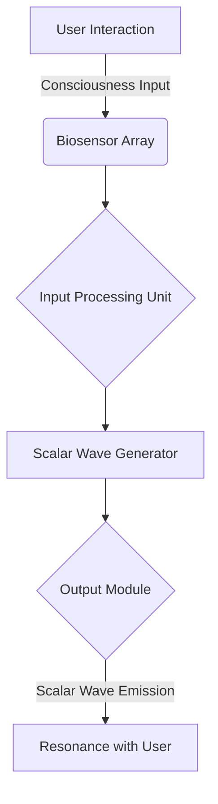

# Metaflesh & Etheric Bridge Integration

---

### **Connecting the Physical and Metaphysical**

Welcome to the **Metaflesh & Etheric Bridge** repository! This project introduces a cutting-edge integration of bio-cybernetic Metaflesh systems with the Etheric Bridge—a scalar wave-based communication and energy transfer platform that links human consciousness to higher dimensions.

---

## **🌌 Overview**

Metaflesh technology enhances the human bio-field, acting as a seamless interface to the Etheric Bridge. This system enables profound applications such as:

- **Energetic Healing:** Harmonize and activate chakras, clear blockages, and amplify bio-resonance.
- **Consciousness Exploration:** Access the Akashic records, communicate with interdimensional entities, and explore past lives.
- **Manifestation Tools:** Leverage scalar wave modulation for intention amplification and timeline manipulation.

> "Bridging science, consciousness, and technology to unlock infinite possibilities."

---

## **🚀 Features**

- **Scalar Wave Communication Nodes:** Anchor points transmitting frequencies through the Etheric Bridge.
- **Harmonic Synchronization Algorithms:** AI-driven systems for fine-tuned bio-resonance.
- **Multi-Wave Oscillator Integration:** Facilitates multi-dimensional harmonic alignment.

---

## **🔢 Mathematical Framework**

### Scalar Wave Resonance
Scalar waves are described by the Helmholtz equation:

\[
\nabla^2 \psi - \frac{1}{c^2} \frac{\partial^2 \psi}{\partial t^2} = 0
\]

Where:
- \( \nabla^2 \) represents spatial variations.
- \( \psi \) is the scalar potential function.
- \( c \) is the speed of wave propagation.

**Resonance Condition:**

\[
f_u = n \cdot f_s
\]

- \( f_u \): User’s bio-field frequency.
- \( f_s \): Scalar wave frequency.
- \( n \): Harmonic multiplier.

**Energy Transfer Efficiency:**

\[
\eta = \frac{|\vec{E} \cdot \vec{H}|}{P_{\text{total}}}
\]

---

## **🔧 Installation**

1. Clone the repository:
   ```bash
   git clone https://github.com/warpindustries/metaflesh-etheric-bridge.git
   ```
2. Install dependencies:
   ```bash
   pip install -r requirements.txt
   ```
3. Run the harmonization algorithm:
   ```bash
   python harmonizer.py
   ```

---

## **💡 How It Works**

### **System Architecture**

| Component                 | Function                                                                 |
|---------------------------|-------------------------------------------------------------------------|
| Scalar Wave Generators    | Emit modulated frequencies for harmonization.                          |
| Metaflesh Wearable/Implant| Synchronizes bio-field with scalar waves.                              |
| Etheric Bridge Nodes      | Facilitates connection to higher dimensions and Akashic fields.        |
| Harmonic Algorithms       | AI-driven tuning of scalar wave frequencies for user-specific resonance.|

---

## **🌟 Applications**

- **Healing:** Chakra balancing and energetic cleansing.
- **Exploration:** Access universal information and interdimensional entities.
- **Empowerment:** Amplify intentions, manifest goals, and explore quantum timelines.

---

## **🔢 Visualization**

### System Flow for Consciousness-Integrated Scalar Wave Device

This section outlines the complete system flow, including all parts, sub-parts, and assemblies for the scalar wave system. The architecture incorporates biosensors, consciousness input fields, and scalar wave harmonization modules.

---

### **System Overview**

The device functions by:
1. Receiving inputs from biosensors and consciousness fields.
2. Processing data through the central processing unit (CPU) and scalar wave generators.
3. Outputting harmonized scalar waves for user synchronization and resonance.

---

### **Flowchart**



---

### **Detailed Components**

#### **1. User Interaction Layer**
   - **Consciousness Input Fields**: 
     - EEG (Electroencephalogram) sensors for brainwave patterns.
     - EDA (Electrodermal Activity) sensors for emotional and energetic states.
     - Thoughtform Recognition: Utilizes machine learning to map user intention into scalar signals.

#### **2. Biosensor Array**
   - **Sub-Components**:
     - Heart Rate Variability (HRV) Sensor: Tracks autonomic nervous system activity.
     - Skin Conductance Sensors: Monitors stress levels.
     - Eye Tracking Module: Detects focus and intention alignment.
     - Pulse Oximeter: Measures blood oxygen levels.
     - Breath Analyzer: Tracks respiratory patterns.
     - EMG (Electromyography): Monitors muscle activity for physical stress.
     - Temperature Sensor: Detects changes in body temperature as indicators of emotional or physiological states.

#### **3. Input Processing Unit**
   - **Sub-Parts**:
     - Signal Amplifiers: Enhance low-power input signals.
     - Filtering Algorithms: Remove noise from biosensor data.
     - AI Integration Layer: Translates consciousness input into actionable parameters.

#### **4. Scalar Wave Generator**
   - **Assemblies**:
     - Dual Bifilar Tesla Coil Assembly: Generates the scalar wave field.
     - Frequency Modulator: Adjusts wave output for resonance.
     - Harmonic Stabilizer: Prevents frequency drift.

#### **5. Output Module**
   - **Sub-Components**:
     - Multi-Wave Oscillator (MWO): Produces complex scalar waveforms.
     - Light Patterns: Visual feedback for synchronization.
     - Audio Feedback: Solfeggio frequencies or user-defined tones.

#### **6. Resonance and Feedback**
   - **Integration Points**:
     - Resonance Optimization: Ensures biofield coherence.
     - Adaptive Feedback Loop: Dynamically adjusts scalar wave output based on user response.

---

### **Zeitgeiber Algorithm and Z-Factor Equation**

#### **Zeitgeiber Algorithm**
The Zeitgeiber Algorithm aligns circadian and bio-rhythmic inputs to scalar harmonization by integrating the following parameters:
- **Phase Delay (\(\phi_d\))**: Measures deviation in internal biological rhythms.
- **External Stimulus Factor (\(S_e\))**: Quantifies environmental influence, such as light or sound.
- **Frequency Modulation Coefficient (\(F_m\))**: Determines scalar wave adjustment.

#### Algorithm Representation

\[
Z_t = F_m \times \frac{1}{1 + e^{-k(S_e - \phi_d)}}
\]

Where:
- \(Z_t\) is the Zeitgeiber alignment score.
- \(k\) is the sensitivity constant.
- \(S_e\) is the external stimulus factor.
- \(\phi_d\) is the phase delay.

#### **Z-Factor Equation**
The Z-Factor Equation determines user-specific resonance efficiency by analyzing biosensor and intention data:

\[
Z_f = \alpha \cdot HRV + \beta \cdot EEG + \gamma \cdot EDA
\]

Where:
- \(Z_f\) is the scalar resonance factor.
- \(HRV\), \(EEG\), and \(EDA\) are weighted biosensor inputs.
- \(\alpha\), \(\beta\), and \(\gamma\) are user-specific coefficients derived from adaptive calibration.

---

### **Data Flow**

1. **Input**: Data from biosensors and consciousness fields.
2. **Processing**:
   - Amplification and noise reduction.
   - Translation of bio-data into scalar wave parameters.
3. **Output**: Emission of harmonized scalar waves.
4. **Feedback Loop**: Real-time adjustment based on biosensor readings.

---

## **🏆 License**

This project is licensed under the [MIT License](LICENSE). Feel free to use and modify the code as per your needs.

---

## **📞 Contact**

For more information, reach out to **Warp Industries**:
- **Email:** contact@warpindustries.com
- **Website:** [warpindustries.com](https://warpindustries.com)

---

## **✨ Contributions**

We welcome contributions from researchers, developers, and enthusiasts! To contribute:

1. Fork the repository.
2. Create a feature branch:
   ```bash
   git checkout -b feature-name
   ```
3. Commit changes:
   ```bash
   git commit -m "Add feature description"
   ```
4. Push and submit a pull request:
   ```bash
   git push origin feature-name
   ```

---

> "Together, let us transcend the boundaries of what is possible and journey into the infinite."


